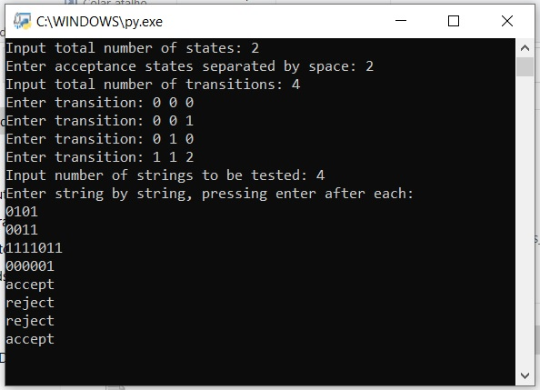

# Finite-Automata AKA Finite State Machine.
Python code for a Finite Automata simulator for both deterministics and non-deterministics.

This is a simple and easy code, that anyone with basic python can fully understand. The code is commented but here is how it works:

The function to solve the automata works fully on a Python data structure called Dictionary: Check this page to learn more about em if you need or want so: https://www.w3schools.com/python/python_dictionaries.asp

Our dictionary can be seen as the transition function for our FA. States are our outter set of keys, symbols are our inner set of keys and Next State is the value for this last set. Just like this:

dfa = {0:{'a':[0, 1], 'b':[1]}, 1:{'a':[1, 2], 'b':[0]}, 2:{'a':[1], 'b':[2]}}

The function iterates through the string of symbols to be tested, change states accordingly, and at the end of the string it checks wheter the state is in the set of accepted states or not. Note that empty words are noted as "-". If state is accepted return True, if not return False. But these are not the only stopping conditions: What happens if we try a transition that's undefined ? Well, in this case it returns False without reaching the end of the string. 
For each list of possible "next state" the function call itselves recursively and if any of it returns True, than it is because there's a path that leads to an accepted state at the end of the string, thus making it acceptable.

Example of inputs can be seen here: 

For the inputs: All you need to do provide is the total number of states, all the acceptance states and the transitions itself, to build the accepted set and the dictionary. Initial state is given directly on the function, as for what I designed this it would only be state 0, then it was way better to keep my code cleaner as possible.

Final consideration: This is by no mean an optmized code, as it was part of a school task and time was short.